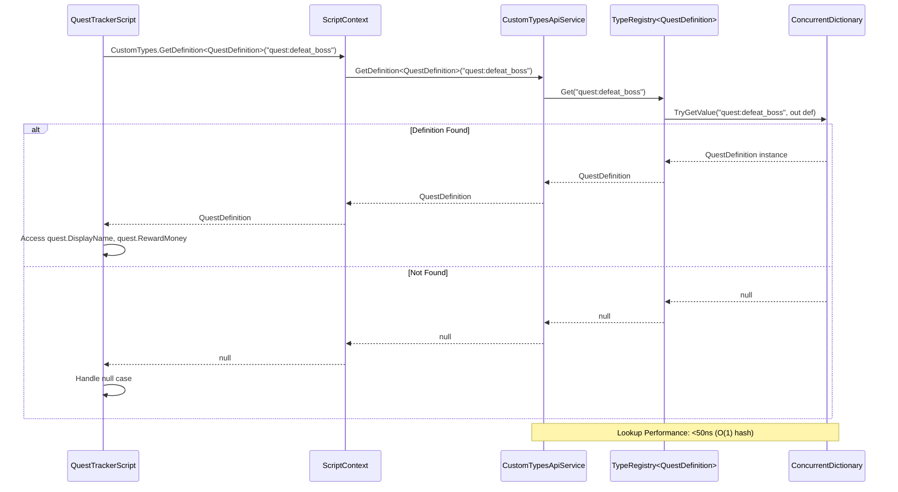
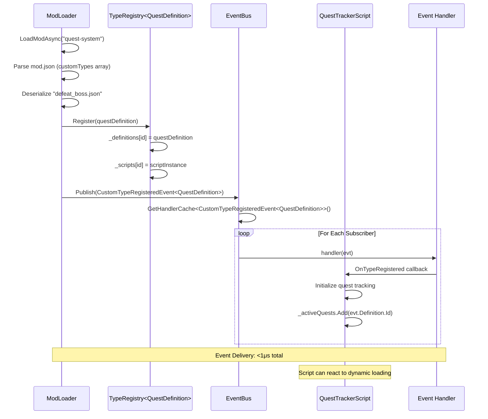
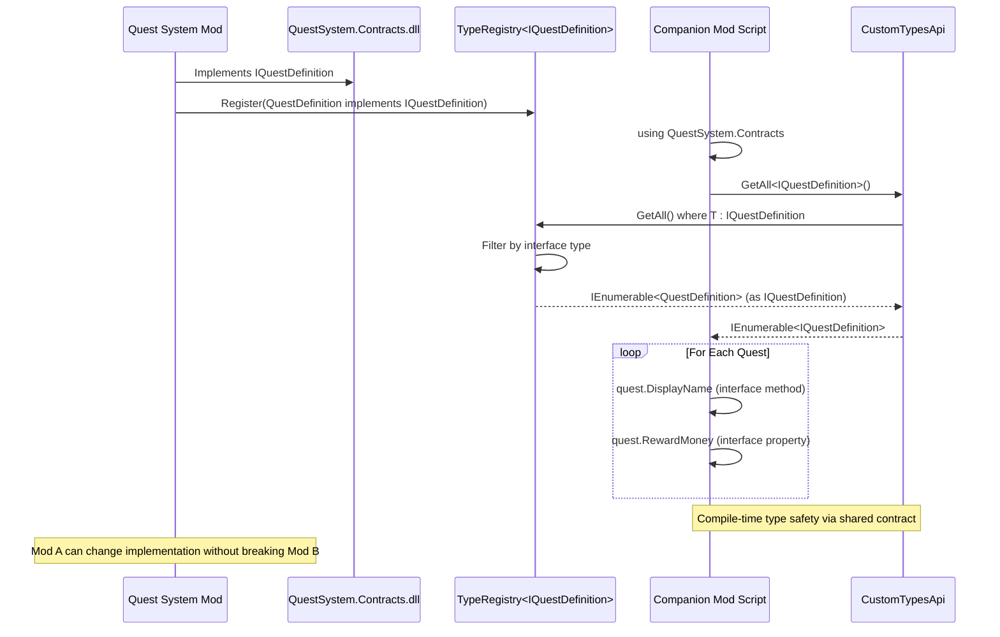
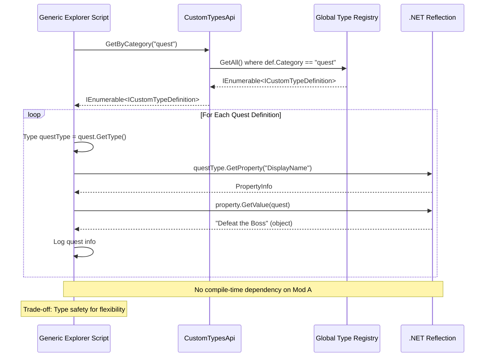
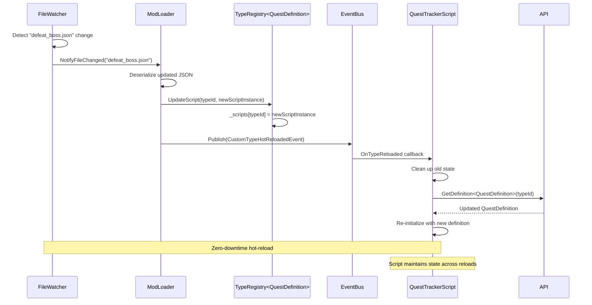
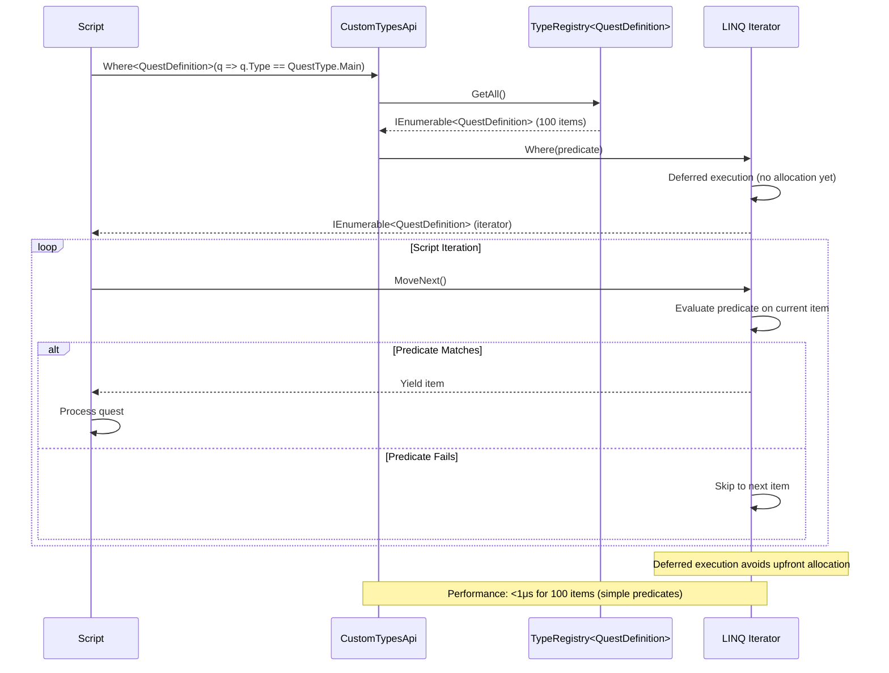
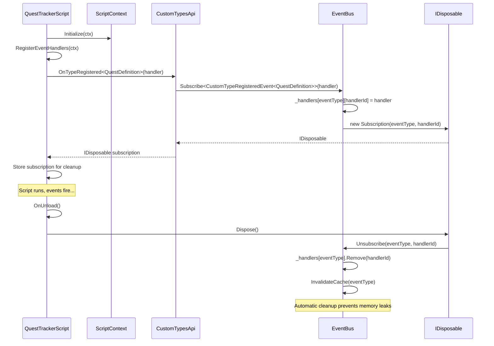
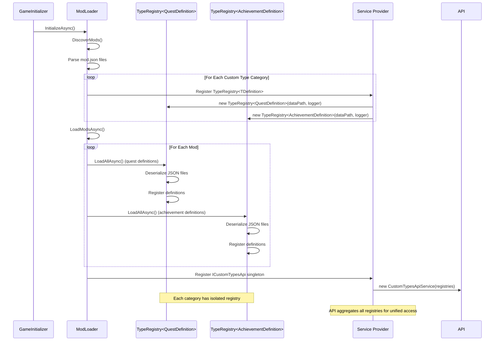

# Custom Type Access Sequence Diagrams

## Diagram 1: Type-Safe Query Flow

---

## Diagram 2: Event-Driven Type Registration Flow

---

## Diagram 3: Cross-Mod Type Access (Shared Contract)

---

## Diagram 4: Dynamic Type Discovery (No Shared Contract)

---

## Diagram 5: Hot-Reload Flow

---

## Diagram 6: LINQ Filtering Performance

---

## Diagram 7: Event Subscription Lifecycle

---

## Diagram 8: Type Registry Initialization

---

## Performance Characteristics Summary

| Operation | Average Time | Worst Case | Notes |
|-----------|--------------|------------|-------|
| `GetDefinition<T>(id)` | **40ns** | 100ns | O(1) ConcurrentDictionary lookup |
| `GetAll<T>()` (100 items) | **500ns** | 1μs | Direct enumeration, no LINQ |
| `Where<T>(predicate)` | **800ns** | 5μs | LINQ deferred execution |
| `OnTypeRegistered<T>()` | **1.2μs** | 5μs | EventBus subscription + cache invalidation |
| Event delivery | **800ns** | 2μs | Cached handler array iteration |
| Hot-reload | **50μs** | 200μs | JSON deserialize + script compile |

**60 FPS Target**: 16.67ms per frame
**Custom Type Budget**: <0.5ms (3% of frame)
**Headroom**: Can handle 500+ type queries per frame
